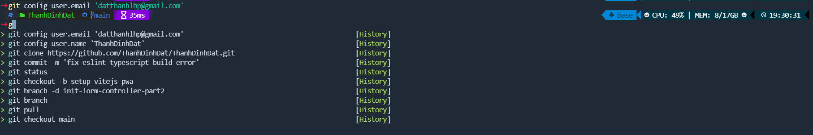

# Requirements
+ OS: Window 10/11


# Terminal alternatives
+ [Tabby](https://tabby.sh/) - A terminal for the modern age

# Open powershell
## ADD "OH MY POSH" TO YOUR SHELL
They have an amazing docs [here](https://ohmyposh.dev/docs/installation/windows)

### Personal Powershell configs
- All of my personal powershell configurations can be found at [HERE](./Powershell/)

## Add colorful icons/color
- Install the packages
```
Install-Module -Name Terminal-Icons -Repository PSGallery
```
- Add to your `$PROFILE` - you can use VSCode to edit `$PROFILE` with `code $PROFILE`
```
Import-Module -Name Terminal-Icons
```

## Show recent history commands when typing
- Install the amazing [PSReadLine](https://github.com/PowerShell/PSReadLine?WT.mc_id=-blog-scottha)

## Personal powershell_profile
```
oh-my-posh init pwsh --config ~/.thanhdinhdat.omp.json | Invoke-Expression
Import-Module -Name Terminal-Icons
Import-Module PSReadLine
Set-PSReadLineOption -PredictionSource History
Set-PSReadLineOption -PredictionViewStyle ListView
Set-PSReadLineOption -EditMode Windows
```
## Powershell Intellisense
### Commands
Add the following lines to your `$Profile`
```
Set-PSReadlineKeyHandler -Key Tab -Function MenuComplete
```
### Github branch autocomplete
+ Install [posh-git](https://github.com/dahlbyk/posh-git#installation)
+ Add to your `$profile`:
```
Import-Module posh-git
```

# Notes
- All the `PSReadLineOption` related settings need [PSReadLine](https://github.com/PowerShell/PSReadLine?WT.mc_id=-blog-scottha) available in your system
- The alternative amamzing prompt theme you can use is [Starship](https://github.com/starship/starship)
# Ref
- Big thanks for [HanselMan](https://www.hanselman.com/blog/my-ultimate-powershell-prompt-with-oh-my-posh-and-the-windows-terminal)
- [Awesome Powershell](https://github.com/janikvonrotz/awesome-powershell)
